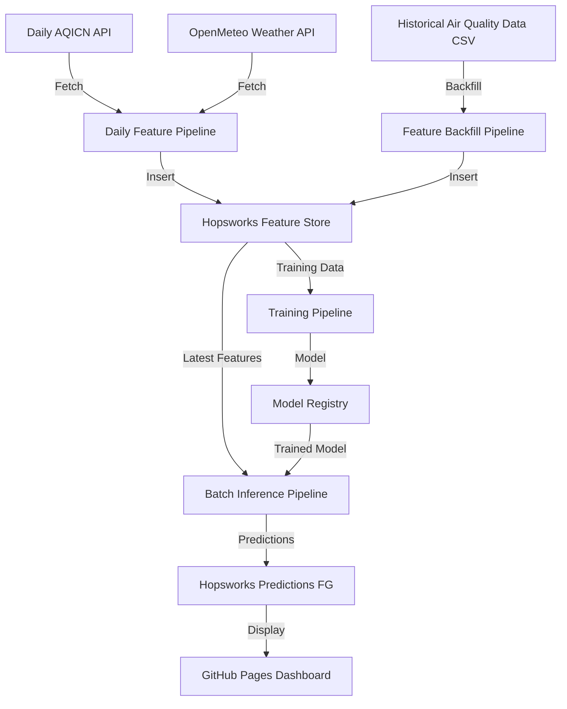

# Air Quality Prediction - Västerbotten Region

A scalable machine learning system for predicting PM2.5 air quality levels in Västerbotten, Sweden using feature pipelines and batch inference.

## 🌐 Dashboard

[Click me to see the dashboard](https://gusreinaos.github.io/ID2223-scalable-machine-learning/)

## 📍 Region & Sensors

**Region:** Västerbotten, Sweden

We monitor air quality using sensors from two cities in Västerbotten:

### Skellefteå Sensors
- **AC846 Station** (A409513) - Lat: 64.944, Lon: 20.038
- **Mobackavägen** (A497266) - Located in Kv. Pantern area

### Umeå Sensors  
- **Östermalmsgatan** (A60886) - Lat: 63.824, Lon: 20.288
- **Vittervägen** (A60073) - Lat: 63.808, Lon: 20.336

All sensors measure **PM2.5** particulate matter levels sourced from [AQICN](https://aqicn.org/).

## 🔄 ML Pipeline

## 📓 Local Notebooks

The `local_notebooks/` directory contains four Jupyter notebooks that implement the ML pipeline:

1. **`1_air_quality_feature_backfill.ipynb`** - Loads historical PM2.5 data from CSV files and backfills the feature store with past air quality and weather measurements
2. **`2_air_quality_feature_pipeline.ipynb`** - Daily pipeline that fetches current air quality from AQICN API and weather from OpenMeteo, scheduled to run daily via GitHub Actions
3. **`3_air_quality_training_pipeline.ipynb`** - Trains XGBoost regression model on historical features to predict PM2.5 levels and stores model in registry
4. **`4_air_quality_batch_inference.ipynb`** - Generates daily predictions using trained model and latest features, writes forecasts to feature store

## 🚀 Getting Started

1. Set up `.env` file with required API keys (HOPSWORKS_API_KEY, AQICN_API_KEY)
2. Run notebook 1 to backfill historical data
3. Run notebook 3 to train the model
4. Schedule notebook 2 (daily feature pipeline) and notebook 4 (batch inference) to run daily

## 📦 Requirements

See `requirements.txt` for Python dependencies. Key libraries: hopsworks, pandas, xgboost, scikit-learn.
